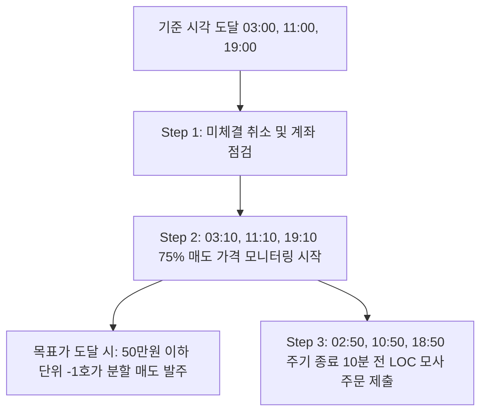

# 암호화폐(Coin)용 무한매수법 CA V4.0 전략 명세서

본 문서는 한국 주요 암호화폐 거래소 **업비트(Upbit)** 및 **빗썸(Bithumb)**의 그리드 트레이딩 프로젝트(`grid_trading_cc`, `gridbithumb`)에 **무한매수법(CA) V4.0 전략**을 이식하기 위한 상세 표준 기술 마이그레이션 명세서입니다.

---

## 1. 코인 시장(24시간) 환경에서의 CA V4.0 기본 프레임워크

주식 시장(하루 1회 장마감)과 달리 암호화폐 시장은 **24시간 연중무휴**로 운영되므로, 시간 기준 및 주문 주기 체계를 재정의합니다.

### 1.1. 거래 주기 설정 (8시간 단위)
* **1회차(1 Turn)의 기준 시간**을 기존 24시간(1일)에서 **8시간**으로 단축합니다. (하루 최대 3회차 진행 가능)
* **주문 실행 시간표 (KST 기준):**
  * **03:00 KST / 11:00 KST / 19:00 KST** (또는 거래소/사용자 설정에 따라 02:00/10:00/18:00)

### 1.2. 3단계 배치 실행 프로세스 (계좌 점검 및 실시간 가격 모니터링)
각 기준 시간대가 도달하면 시스템은 다음 프로세스를 거쳐 주문을 집행합니다.



1. **Step 1: 미체결 취소 및 계좌 점검 (03:00 / 11:00 / 19:00 KST)**
   * 이전 8시간 주기 동안 체결되지 않고 남아 있는 모든 매수/매도 지정가 주문을 API를 통해 **전량 취소**하고 2초간 대기합니다.
   * 취소 완료 후, 현재 계좌의 **총 잔고(`balance + locked`), 평단가, T회차 및 운용 모드(NORMAL/REVERSE)**를 다음 사이클의 기준으로 공식 동기화합니다.
   * **(+1분 후, 03:01 / 11:01 / 19:01 KST)**: 텔레그램으로 현재 T회차, 평단가, Star%, 잔여 Pool CA 상태 보고를 자동 발송합니다.
2. **Step 2: 75% 매도 가격 모니터링 시작 (03:10 / 11:10 / 19:10 KST)**
   * 정각 10분에 거래소에 주문을 즉시 발주하지 않고 **실시간 가격 모니터링**을 시작하며, 목표가와 현재가를 텔레그램 메시지로 안내합니다.
   * **목표가 도달 시**: 현재가 대비 **-1호가(`get_tick_lower`) 지정가로 50만원 이하 단위로 분할 발주**하여 호가창 매물 소화 및 즉시 체결을 보장합니다.
3. **Step 3: LOC 모사 주문 제출 (02:50 / 10:50 / 18:50 KST - 주기 종료 10분 전)**
   * 다음 사이클 시작 10분 전 25% Star% 매도 주문 및 모드별(전반전/후반전/리버스) LOC 모사 매수 주문을 발주합니다.
   * **체결 신속성 및 분할 발주 보장**: 매수 주문은 현재가 대비 +1호가(`get_tick_higher`), 매도 주문은 현재가 대비 -1호가(`get_tick_lower`)로 제출하며, **모든 주문(리버스 모드 포함)은 50만원 이하 단위로 분할 발주**되어 체결 안정성을 극대화합니다.

---

## 2. 암호화폐용 LOC 모사(Simulation) 및 호가 보정 주문 방식

업비트와 빗썸은 API 레벨에서 `LOC (Limit on Close)` 주문 타입을 제공하지 않으므로, **현재가 확인 후 1호가 스프레드 교차(매수 시 +1호가, 매도 시 -1호가) 지정가 주문 및 50만원 단위 분할 발주**를 활용하여 즉시 체결되는 LOC를 모사합니다.

### 2.1. 매수 LOC 모사 (평단 + 별값)
* **평단 LOC 매수:** 현재 체결가가 계좌 평단가 이하일 때 **현재가보다 1호가 높은 가격(`curr_price + 1 tick`)**으로 50만원 이하 분할 매수 제출하여 즉시 체결.
* **별값(Star%) LOC 매수:** 현재 체결가가 평단가 $\times (1 + Star\%)$ 이하일 때 **현재가보다 1호가 높은 가격(`curr_price + 1 tick`)**으로 50만원 이하 분할 매수 제출하여 즉시 체결.

### 2.2. 매도 LOC 모사 및 75% 지정가 매도
* **75% 지정가 매도:** 실시간 감시 후 목표가 도달 시 현재가 -1호가로 **50만원 이하 단위 분할 발주**하여 즉시 체결.
* **25% 별지점 LOC 매도:** 현재가가 평단가 $\times (1 + Star\%)$ 목표가 이상일 때 **현재가보다 1호가 낮은 가격(`curr_price - 1 tick`)**으로 50만원 이하 분할 매도 제출하여 즉시 체결.
* **리버스 쿼터 매도:** 보유 수량 25%에 대해 MA5 이상 시 현재가 -1호가로 50만원 이하 분할 매도.

---

## 3. 코인용 CA V4.0 핵심 전략 공식 (Python 코드 연계)

주식 버전 CA V4.0 공식 및 보정 로직을 그대로 계승하여 이식합니다.

### 3.1. Turns ($T$값) 연산
$$T = \frac{\text{누적 매입금액}}{\text{1회 매수금}}$$

### 3.2. 유동적 1회 매수금
$$\text{1회 매수금} = \frac{\text{가용 Pool}}{a - T}$$
* **가용 Pool ($s\_pool$):** `설정 Pool - (현재 보유 수량 * 평단가)`
* **$a$:** 사용자가 설정한 최대 분할수 (기본 40분할)

### 3.3. Star% 계산 공식 (수정본 적용)
$$Star\% = \text{목표수익률}(\%) \times \left(1 - \frac{T}{20} \times \frac{T_{default}}{a_{default}}\right) \%$$

```python
import math

def calculate_coin_star_percent(target_profit_pct, current_t, T_default=40, a_default=40) -> float:
    t = max(0.0, current_t)
    raw_star = target_profit_pct * (1.0 - (t / 20.0) * (T_default / a_default))
    raw_star = round(raw_star, 9)
    return math.ceil(raw_star * 10000) / 10000.0
```

### 3.4. 리버스 모드 (소진 후 소생 모드) 상세 명세 (8시간 캔들 기준)
* **발동 조건:** $T \ge a - 1$ 도달 시 리버스 모드 진입.
* **리버스 별지점 기준가:** 직전 5개의 8시간 봉 종가 평균($MA5$) 사용.
* **매도 로직 (무한 매도)**:
  * 전체 수량의 $1 / (a/2)$ 분량을 매도 (40분할 시 5%).
  * **1회차**: 강제 매도 (현재가 -1호가, 건당 최대 50만원 분할).
  * **2회차부터**: $MA5$ 위에서 LOC 매도 (현재가 $\ge MA5$ 시 -1호가).
* **매수 로직 (쿼터 매수)**:
  * **1회차**: 매수 없음 (현금 확보).
  * **2회차부터**: 가용 Pool의 25%를 $MA5$ 아래에서 LOC 매수 (현재가 $\le MA5$ 시 +1호가).
* **리버스 T값 업데이트**:
  * 매도 시: $\text{직전}T \times (1 - \frac{1}{a/2})$
  * 매수 시: $\text{직전}T + (a - \text{직전}T) \times 0.25$
* **종료(회귀) 조건**:
  * 현재가 $\ge \text{평단가} \times (1 - \frac{\text{목표수익률}}{100})$ 달성 시 일반 모드로 자동 복귀.

---

## 4. 대시보드(Streamlit UI) 및 사이드바 아키텍처

### 4.1. 7대 메인 탭 구조
1. **[ 📈 그리드 현황 ]**: 기존 초단타 그리드 매매 모니터링
2. **[ ⭐ 무한매수법 CA ]**: 8시간 주기 CA V4.0 전용 대시보드
3. **[ 💎 밸류 리밸런싱 VR ]**: 2주 주기 VR 전용 대시보드
4. **[ 📋 거래 내역 ]**: 전략별(그리드/CA/VR) 통합 주문/체결 내역 조회
5. **[ 📊 수익 분석 ]**: 서브 탭 분리 (그리드 수익분석 / CA 수익분석 / VR 수익분석)
6. **[ 🗃️ 종료된 전략 ]**: 완결 및 수동 종료된 전략 아카이빙
7. **[ ⚙️ 시스템 설정 ]**: API 키, 텔레그램 토큰, DB 동기화 제어

### 4.2. 사이드바 제어 UI
* **전략 상태 뱃지**: 🟢 가동 중 / ⏸️ 일시정지 / 🔄 리버스 모드
* **4대 제어 버튼**:
  * **⏸️ 일시정지**: 매매를 일시 정지하고 상태 DB 커밋 (`is_running='false'`)
  * **▶️ 다시시작**: 매매를 재개하고 상태 DB 커밋 (`is_running='true'`)
  * **🔄 동기화**: 거래소 실시간 잔고 및 미체결 상태 강제 동기화
  * **🛑 종료**: 미체결 전량 취소, 실현손익 `closed_strategies` DB 저장 및 영구 종료

---

## 5. 코인 거래소 API 특화 고려사항

1. **최소 주문 금액 (업비트/빗썸 5,000 KRW 전수 일원화):**
   * **업비트 KRW 마켓:** 최소 주문 금액 **5,000 KRW**
   * **빗썸 KRW 마켓:** 공식 최소 주문 금액 **5,000 KRW** (`MIN_ORDER_AMOUNT_KRW = 5000`)
   * 0.5T 또는 1.0T 매수 금액이 5,000 KRW 미만일 경우 `max(5000, order_amount)`로 올림 보정하여 주문 실패 방지.
2. **수량 계산 소수점 4자리 절사:**
   * `qty = math.floor((amount_to_invest / price) * 10000) / 10000.0`
3. **호가 경계선 자동 보정 (`get_shifted_tick_price`):**
   * 거래소별 호가 단위 룰에 따라 ±1호가 가격 자동 산출.
4. **50만원 분할 발주 & API Rate Limit 방어:**
   * 대량 주문 시 50만원 이하 단위로 분할하여 0.2초 간격으로 순차 발주.
5. **자투리 잔고(Dust) 자동 완결 및 다음 차수 승계:**
   * 매도 후 잔여 코인 평가액이 1회 매수금 미만이거나 5,000원 미만일 경우 차수 완결 판정 및 다음 차수(2차) 자동 승계.
