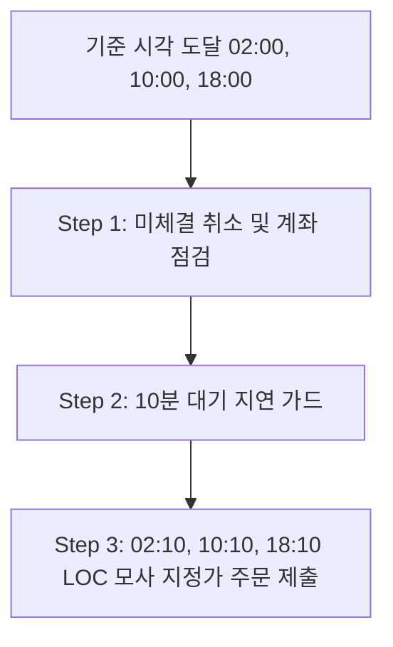

# 암호화폐(Coin)용 무한매수법 CA V4.0 전략 명세서

이 문서는 한국의 주요 암호화폐 거래소인 **업비트(Upbit)** 및 **빗썸(Bithumb)**의 그리드 트레이딩 프로젝트(`grid_trading_cc`, `gridbithumb`)에 **무한매수법(CA) V4.0 전략**을 이식하기 위한 기술 설계 및 마이그레이션 명세서입니다.

---

## 1. 코인 시장(24시간) 환경에서의 CA V4.0 기본 설계

주식 시장(하루 1회 정규장 마감)과 달리 암호화폐 시장은 **24시간 연중무휴**로 가동되므로, 시간 기준 및 주문 주기 조정을 적용합니다.

### 1.1. 거래 주기 설정 (8시간 단위)
* **1회차(1 Turn)의 기준 시간**을 기존 24시간(1일)에서 **8시간**으로 단축합니다. (하루 최대 3회차 진행 가능)
* **주문 실행 시간표 (KST 기준):**
  * **02:00 KST / 10:00 KST / 18:00 KST**

### 1.2. 3단계 배치 실행 프로세스 (계좌 점검 및 10분 지연 주문)
각 기준 시간대(02시, 10시, 18시)가 도달하면 시스템은 다음 프로세스를 거쳐 주문을 집행합니다.



1. **Step 1: 미체결 취소 및 계좌 점검 (02:00 / 10:00 / 18:00 KST)**
   * 이전 8시간 주기 동안 체결되지 않고 남아 있는 모든 매수/매도 지정가 주문을 API를 통해 **전량 취소**합니다.
   * 취소 완료 후, 현재 계좌의 **잔고(보유 코인 수량, 평단가) 및 가용 원화(KRW) 예수금**을 조회하여 메모리 및 DB 상태를 동기화합니다.
2. **Step 2: 10분 지연 가드 (10분간 대기)**
   * 계좌 조회가 완료된 후 즉시 주문을 넣지 않고, **10분간 대기**합니다.
   * 이는 이전 주기 미체결 취소의 거래소 반영 시간 보장, 8시간 캔들 봉(09시 봉 등) 마감 및 시세 안정화를 위한 안전 대기 마진입니다.
3. **Step 3: LOC 모사 주문 제출 (02:10 / 10:10 / 18:10 KST)**
   * 대기 시간이 끝난 후, 계산된 CA V4.0 전략 기준에 따라 신규 **매수 및 매도 주문을 지정가(Limit Order)로 제출**합니다. 이 주문들은 다음 기준 시각(8시간 뒤)까지 유지됩니다.

---

## 2. 암호화폐용 LOC 모사(Simulation) 주문 구현 방식

업비트와 빗썸은 API 레벨에서 `LOC (Limit on Close)` 주문 타입을 제공하지 않으므로, **8시간 동안 유지되는 지정가(Limit) 주문**을 활용하여 LOC를 모사합니다.

### 2.1. 매수 LOC 모사 (지정가 + 오프셋)
* **평단 LOC 매수:** 계산된 평단가 가격으로 일반 지정가 매수 제출.
* **별지점(Star%) LOC 매수:** 평단가 $\times (1 + Star\%)$ 가격에 **Buy Offset**(-0.01% 내외)을 적용한 지정가 매수 제출.
* **주기 만료 시 자동 청소:** 8시간 뒤 체결되지 않은 주문은 **Step 1**에서 취소 처리되므로, 결과적으로 종가가 지정 조건 가격 이하로 내려갔을 때만 체결되어 LOC 매수와 동일하게 작동합니다.

### 2.2. 매도 LOC 모사
* **75% 지정가 매도:** 평단가 + 목표수익률 지정가 매도 제출.
* **25% 별지점 LOC 매도:** 평단가 $\times (1 + Star\%)$ 가격으로 지정가 매도 제출.

---

## 3. 코인용 CA V4.0 핵심 전략 공식 (Python 코드 연계)

주식 버전 CA V4.0 공식 및 보정 로직을 그대로 계승하여 이식합니다.

### 3.1. Turns ($T$값) 연산
소수점 조정(반올림/올림/버림)을 하지 않고 계산값 그대로 사용합니다.
$$T = \frac{\text{누적 매입금액}}{\text{1회 매수금}}$$

### 3.2. 유동적 1회 매수금
고정 금액이 아닌, 남은 잔여 예수금을 기준으로 매 주기 재계산합니다.
$$\text{1회 매수금} = \frac{\text{가용 Pool}}{a - T}$$
* **가용 Pool ($s\_pool$):** `설정 Pool - (현재 보유 수량 * 평단가)`
* **$a$:** 사용자가 설정한 최대 분할수 (기본 40분할)

### 3.3. Star% 계산 공식 (수정본 적용)
피드백이 반영된 곱셈식 수식과 부동소수점 오차 보정을 필수로 구현합니다.
$$Star\% = \text{목표수익률}(\%) \times \left(1 - \frac{T}{20} \times \frac{T_{default}}{a_{default}}\right) \%$$

```python
import math

def calculate_coin_star_percent(target_profit_pct, current_t, T_default=40, a_default=40) -> float:
    t = max(0.0, current_t)
    # T/20 곱셈 비율 공식 적용
    raw_star = target_profit_pct * (1.0 - (t / 20.0) * (T_default / a_default))
    # 부동소수점 곱셈 오차 보정
    raw_star = round(raw_star, 9)
    # 소수점 넷째 자리 올림 (암호화폐 별값 공통 규칙)
    return math.ceil(raw_star * 10000) / 10000.0
```

### 3.4. 리버스 모드 별지점 가격 계산 (8시간 캔들 기준)
* **발동 조건:** $T > a - 1$ 시점 진입.
* **리버스 별지점 기준가:** 주식의 '5거래일 종가 평균' 대신, **'직전 5개의 8시간 봉 종가 평균(Average of last 5 candles of 8H)'**을 사용합니다.
  * 업비트 (`/v1/candles/minutes/240` 또는 `/v1/candles/days` 활용하여 8시간 단위 종가 파싱)
  * 빗썸 (`/public/candlestick` 활용하여 8시간 캔들 데이터 추출)

---

## 4. Streamlit 대시보드 (UI) 개편 가이드

기존 그리드 트레이딩(Grid Trading) 대시보드의 화면을 보존하면서 CA V4.0 전략 상태를 모니터링할 수 있도록 탭(Tab) 아키텍처를 적용합니다.

```
┌────────────────────────────────────────────────────────┐
│  📊 암호화폐 통합 트레이딩 대시보드                    │
├────────────────────────────────────────────────────────┤
│  [ ✅ Grid Trading 탭 ]  [ ⭐ CA V4.0 무한매수법 탭 ]  │
├────────────────────────────────────────────────────────┤
│  • 전략 상태: NORMAL / REVERSE / PAUSED                │
│  • 회차 (T): 14.5 / 40.0                               │
│  • 실시간 가용 Pool: ₩1,240,500 / ₩5,000,000           │
│  • 현재 Star%: -1.25% | 목표 수익률: 10.0%             │
│  ├──────────────────────────────────────────────────┤  │
│  │ 🛒 8시간 주기 주문 예약 가이드 (02:10/10:10/18:10) │  │
│  │  - 평단 매수 (0.5T): ₩85,420,000 (0.012 BTC)      │  │
│  │  - Star% 매수(0.5T): ₩84,352,250 (0.012 BTC)      │  │
│  └──────────────────────────────────────────────────┘  │
└────────────────────────────────────────────────────────┘
```

### 주요 추가 위젯 설계
1. **사이드바 설정 필터:**
   * 전략 타입 선택에 `Grid` 및 `CA V4.0` 추가.
   * `CA V4.0` 선택 시: 최대 분할수($a$), 목표수익률, 1회 매수금 산출을 위한 Pool 설정 필드 노출.
2. **실시간 모니터링 메트릭:**
   * 현재가 및 평단가 대비 실시간 손익률.
   * 현재 주기(02시, 10시, 18시) 진행 상태 및 다음 주문 제출 시간 카운트다운 표시.
3. **주문 현황 및 이력 테이블:**
   * 8시간마다 갱신 및 취소되는 지정가 주문 내역을 실시간으로 형변환하여 표기.

---

## 5. 코인 거래소 API 특화 고려사항

1. **최소 주문 금액 제약 가드:**
   * 업비트 KRW 마켓의 최소 주문 금액은 **5,000 KRW**입니다.
   * 빗썸 KRW 마켓의 최소 주문 금액은 **500 KRW**입니다.
   * 계산된 0.5T 또는 1.0T 매수 금액이 이 제약보다 작을 경우, 주문을 스킵하거나 최소 주문 금액으로 강제 보정하는 예외 처리(`if order_amount < 5000: ...`)를 반영해야 합니다.
2. **수량 계산의 소수점 4자리 확장 및 포맷팅 (정수 제한 탈피):**
   * 기존 주식 레버리지 ETF 전략에서는 1주 미만 소수점 주문이 불가능하여 매매 단위를 **정수(int) 수량**으로 엄격히 제한(내림 처리)했었습니다.
   * 반면, 암호화폐 거래소(업비트/빗썸 등)는 소수점 단위 거래를 공식적으로 지원하므로, CA V4.0 전략의 매수/매도 수량을 **소수점 이하 4자리**까지 확장하여 계산하도록 정밀도를 조정합니다.
   * **수량 계산 공식:**
     `qty = math.floor((amount_to_invest / price) * 10000) / 10000.0`
   * 소수점 4자리 아래의 잔여 수량은 절사(버림) 처리하여 주문 가능 금액 초과로 인한 주문 실패를 방지하고, 소수점 단위 유동성을 최대한 활용할 수 있도록 구현합니다.
3. **API Rate Limit 방어:**
   * 대시보드 조회나 스케줄러 가동 시 초당 호출 제한을 고려하여 REST API 호출 사이에 적절한 지연(`time.sleep(0.2)`)을 설정합니다.
