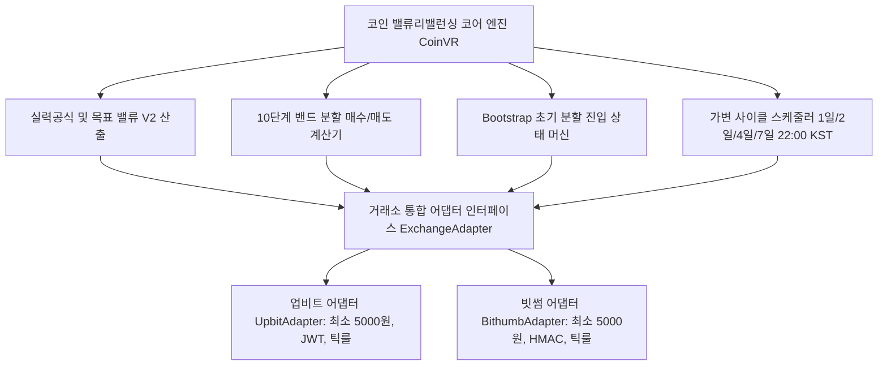
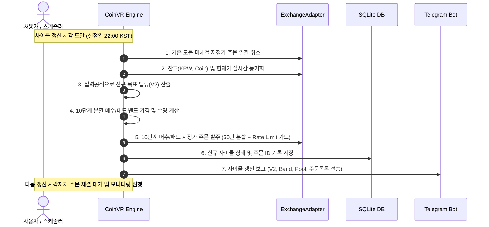

# 암호화폐(Coin) 통합 밸류 리밸런싱(Value Rebalancing, VR) 전략 명세서

본 문서는 미국/한국 주식 시장에서 검증된 **라오어의 밸류 리밸런싱(Value Rebalancing, VR) 및 실력공식(Skill Formula)**을 국내 주요 암호화폐 거래소인 **업비트(Upbit)**와 **빗썸(Bithumb)**에 통합 적용하기 위한 표준 암호화폐 밸류 리밸런싱 전략 명세서입니다.

---

## 1. 전략 개요 및 코인 시장 가변 사이클 타임 아키텍처

### 1.1. 밸류 리밸런싱(VR) 코인 통합 철학
* 주식 시장의 1주 정수 단위 매매 구조를 **암호화폐의 소수점(Float) 유동성 및 가용 자본 분할($N$등분) 구조로 전면 혁신**하여 이식합니다.
* 24시간 365일 무휴로 거래되는 코인 시장의 특성을 반영하여 **가변 사이클 주기(1일/2일/4일/7일)**, **사용자 지정 일일 갱신 시각(기본 22:00 KST)**, **하락장 방어 실력공식(Skill Formula)**, **Bootstrap(초기 시드 분할 진입) 모드**, **10단계 상/하향 밴드 분할 주문**을 통합 표준화합니다.

### 1.2. 암호화폐 가변 사이클 타임 (Cycle Time) 및 일일 갱신 시각 규격
* **사이클 주기 (Cycle Period) 선택**:
  * **1일 (24시간)**: 초고속 템포의 일일 리밸런싱
  * **2일 (48시간)**: 단기 변동성 대응 리밸런싱
  * **4일 (96시간)**: 중단기 스윙형 리밸런싱
  * **일주일 (7일, 기본 권장)**: 주간 단위 표준 리밸런싱
  * *(선택적 확장: 2주일 / 14일)*
* **전략 밸류($V$) 갱신 기준 시각 (Daily Update Time)**:
  * 하루 중 전략 $V$값을 새로 산출하고 기존 미체결 취소 및 10단계 매수/매도 밴드 주문을 재배치하는 기준 시각을 사용자가 자유롭게 설정.
  * **기본값: 22:00 KST** (09:00, 22:00, 00:00 등 사용자 지정 가능)

### 1.3. 거래소별 환경 비교 및 통합 표준 규격

| 항목 | 업비트 (Upbit) | 빗썸 (Bithumb) | 통합 표준 규격 (`CoinVR`) |
| :--- | :--- | :--- | :--- |
| **사이클 주기** | 가변 주기 지원 | 가변 주기 지원 | **1일 / 2일 / 4일 / 7일 선택 + 갱신 시각(기본 22:00)** |
| **최소 주문 금액** | 5,000 KRW | **5,000 KRW (전수 일원화)** | **5,000 KRW (`MIN_ORDER_AMOUNT_KRW = 5000`)** |
| **기본 거래 수수료** | 0.05% | 0.04% (쿠폰 적용) | 거래소 설정 파라미터화 |
| **수량 정밀도** | 소수점 4~8자리 | 소수점 4자리 | **소수점 이하 4자리 절사 (`floor * 10000 / 10000.0`)** |
| **호가 단위 (Tick)** | 업비트 틱룰 테이블 | 빗썸 틱룰 테이블 | `get_shifted_tick_price(exchange, price, shift)` |
| **대량 주문 보호** | 50만원 이하 단위 분할 발주 | 50만원 이하 단위 분할 발주 | **1건당 최대 50만원 분할 + 0.2초 딜레이** |
| **인증 방식** | JWT 토큰 (Bearer) | HMAC-SHA512 서명 | 어댑터 패턴 (`ExchangeAdapter`) 분리 |



---

## 2. 목표 밸류($V$) 산출: 실력공식 (Skill Formula)

기본 밸류 리밸런싱에 코인 급락장 방어력을 극대화한 **"실력공식"**을 적용하여 곡선형 목표 밸류($V$)를 구축합니다.

### 2.1. 실력공식 (Skill Formula) 표준 수식

사용자가 지정한 사이클 주기(예: 1일/2일/4일/7일)마다 지정된 갱신 시각(기본 22:00 KST)에 도달하면 다음 사이클의 목표 밸류($V_2$)를 아래 공식으로 갱신합니다. (사이클 진행 중에는 $V$를 임의 변경하지 않음)

$$V_2 = V_1 + \frac{\text{Pool}}{G} + \frac{E - V_1}{2\sqrt{G}} + \text{적립금}$$

* $V_1$: 이전 사이클의 목표 밸류
* $V_2$: 신규 사이클의 목표 밸류
* $E$: 직전 사이클 종료 시점(갱신 시각 22:00 KST)의 코인 총 평가액 ($E = \text{총 보유수량} \times \text{현재가}$)
* $\text{Pool}$: 현재 계좌의 가용 원화(KRW) 예수금
* $G$: 기울기 계수
  * **적립식 / 거치식**: $G = 10$ (기본 권장값)
  * **인출식 (수익금 인출 목적)**: $G = 20$
* **적립금**: 해당 사이클에 사용자가 수동/자동으로 추가 투입한 순수 원화 금액

```python
import math

def calculate_next_target_value(v1: float, pool: float, current_eval: float, 
                                G: float = 10.0, deposit: float = 0.0) -> float:
    \"\"\"코인 실력공식에 기반한 차기 목표 밸류(V2) 산출 함수\"\"\"
    term1 = v1
    term2 = pool / G
    term3 = (current_eval - v1) / (2.0 * math.sqrt(G))
    v2 = term1 + term2 + term3 + deposit
    return max(0.0, round(v2, 2))
```

> **코인 시장에서의 실력공식 작동 메커니즘**
> * **상승장 ($E > V_1$)**: 세 번째 항이 양수가 되어 목표 밸류 $V$가 점진적으로 상승, 상단 매도 밴드를 높여 이익을 극대화합니다.
> * **하락장 ($E < V_1$)**: 세 번째 항이 음수가 되어 목표 밸류 $V$의 상승을 강하게 억제하거나 하향 조정(내려앉음)합니다. 이로 인해 끝없는 물타기로 인한 예수금 조기 소진을 원천 차단합니다.

---

## 3. 코인형 분할 매수/매도 밴드 설계 및 주문 생성 공식

주식의 정수 1주 단위 분할 매매를 코인 환경에 맞추어 **가용 자산 분할($N$등분, 기본 $N=10$) 기반의 조화평균 그리드 공식**으로 완전 표준화합니다.

### 3.1. 밸류 밴드(Band) 정의
* **매수 밴드 하단 (Low Band)**: $V \times (1 - \text{band\_pct}/100)$ (기본 $\text{band\_pct} = 15\% \rightarrow V \times 0.85$)
* **매도 밴드 상단 (High Band)**: $V \times (1 + \text{band\_pct}/100)$ (기본 $\text{band\_pct} = 15\% \rightarrow V \times 1.15$)

### 3.2. 코인형 10단계 분할 매수 주문 (지정가)
가용 Pool 중 사용자가 지정한 한도($25\% \sim 75\%$, 기본 50%) 내에서 Low Band 아래로 $N$단계 분할 매수 주문을 발주합니다.

1. **사용 가능 풀 ($P_{\text{usable}}$)**:
   $$P_{\text{usable}} = \text{Pool} \times \frac{\text{pool\_limit\_pct}}{100}$$
2. **1회 분할 매수금 ($M_{\text{buy}}$)**:
   $$M_{\text{buy}} = \frac{P_{\text{usable}}}{N}$$
   * 가드: $M_{\text{buy}} < 5,000\text{ KRW}$인 경우, 분할수 $N$을 동적으로 줄여 건당 최소 5,000 KRW 이상이 되도록 자동 보정합니다.
3. **$k$번째 단계별 매수 지정가 ($P_{\text{buy}, k}$)**:
   $$P_{\text{buy}, k} = \frac{\text{Low Band}}{\text{현재 보유 수량} + k \times \Delta Q_{\text{step}}}$$
   *(여기서 $\Delta Q_{\text{step}} = \frac{M_{\text{buy}}}{P_{\text{curr}}}$)*
   * 거래소별 호가 단위(Tick)로 내림 보정(`get_shifted_tick_price(..., shift=0)`).
4. **$k$번째 단계별 매수 수량 ($Q_{\text{buy}, k}$)**:
   $$Q_{\text{buy}, k} = \text{floor}\left(\frac{M_{\text{buy}}}{P_{\text{buy}, k}} \times 10000\right) / 10000.0$$

### 3.3. 코인형 10단계 분할 매도 주문 (지정가)
보유 코인 중 매도 대상 수량($Q_{\text{sell\_total}}$, 기본 전체 수량의 50~100%)에 대해 High Band 위로 $N$단계 분할 매도 주문을 발주합니다.

1. **1회 분할 매도 수량 ($\Delta Q_{\text{sell}}$)**:
   $$\Delta Q_{\text{sell}} = \text{floor}\left(\frac{Q_{\text{sell\_total}}}{N} \times 10000\right) / 10000.0$$
2. **$k$번째 단계별 매도 지정가 ($P_{\text{sell}, k}$)**:
   $$P_{\text{sell}, k} = \frac{\text{High Band}}{\max(\text{현재 보유 수량} - (k-1) \times \Delta Q_{\text{sell}}, \Delta Q_{\text{sell}})}$$
   * 거래소별 호가 단위(Tick)로 올림 보정.
3. **최소 주문금액 가드**:
   * 매도 예정 금액($P_{\text{sell}, k} \times \Delta Q_{\text{sell}}$)이 5,000 KRW 미만일 경우 잔여 수량을 직전 주문과 병합.

---

## 4. 1회차 초기화 및 Bootstrap (초기 시드 분할 진입) 모드

최초 전략 가동 시 코인 잔고가 없거나 원화 비중이 과도하게 높은 경우를 위해 **Bootstrap 분할 매수 모드**를 지원합니다.

### 4.1. 1회차 최초 목표 밸류 ($V_{\text{init}}$)
* **초기 $V_1$**: $0.0$
* **초기 $P$ (Pool)**: 사용자가 입력한 운용 원화(KRW)
* **초기 $E$ (평가액)**: $\text{기존 보유수량} \times \text{평균매입단가}$ (잔고 없으면 $0.0$)
* **최초 목표 밸류 ($V_2$)**:
  $$V_2 = \frac{P}{G} + \frac{E}{2\sqrt{G}}$$

### 4.2. Bootstrap 자동 진입 및 분할 매수 규칙
1. **진입 조건**:
   * $P_{\text{usable}} (\text{Pool} \times \text{pool\_limit\_pct}/100) > \text{Low Band}$ 인 경우, 초기 코인 비중 확보를 위해 **Bootstrap 모드** 시작.
   * 그렇지 않을 경우 즉시 일반 `RUNNING` 밸류리밸런싱 모드로 시작.
2. **Bootstrap 분할 실행 (10일 또는 5일)**:
   * 매일 지정 갱신 시각(기본 22:00 KST)에 $P_{\text{usable}}$의 **10등분(10일)** 또는 **5등분(5일)**을 분할 매수.
   * 건당 매수 금액이 5,000 KRW 이상이어야 하며, 5등분으로도 부족할 경우 즉시 일반 모드로 전환.
3. **일반 모드 전환**:
   * 지정 일수(10일/5일) 매수가 완료되면 계좌 실잔고 기준으로 실력공식을 적용하여 정규 $V_2$를 산출하고 일반 `RUNNING` 모드로 진입.

---

## 5. 실행 프로세스 및 대시보드(Streamlit UI) 연계

### 5.1. 가변 사이클(1일/2일/4일/7일 22:00 KST) 라이프사이클



### 5.2. 대시보드 7대 탭 통합 및 [ 💎 Value Rebalancing ] 전용 탭 구성

기존 업비트/빗썸 대시보드의 아키텍처를 유지하면서 **3번째 메인 탭**으로 통합 제공합니다.

```
┌────────────────────────────────────────────────────────────────────────────────────────┐
│  📊 암호화폐 통합 자동매매 대시보드 (업비트 / 빗썸)                                   │
├────────────────────────────────────────────────────────────────────────────────────────┤
│  [ 📈 그리드 현황 ] [ ⭐ 무한매수법 CA ] [ 💎 밸류 리밸런싱 VR ] [ 📋 거래 내역 ]       │
│  [ 📊 수익 분석 (그리드/CA/VR) ] [ 🗃️ 종료된 전략 ] [ ⚙️ 시스템 설정 ]                  │
├────────────────────────────────────────────────────────────────────────────────────────┤
│  💎 [밸류 리밸런싱 VR] VR-BTC-1차 (KRW-BTC)                         [ 🔄 잔고/시세 동기화 ] │
│  > 전략 기본 정보 (거래소: 빗썸/업비트, 설정 Pool: ₩10,000,000, 주기: 4일, 갱신: 22:00)│
│                                                                                        │
│  [ 사이클 진행 상태 ]        [ 목표 밸류 (V) ]             [ 현재 코인 평가액 (E) ]    │
│    🟢 RUNNING (3일차 / 4일)      ₩12,450,000                   ₩11,820,000 (0.1245 BTC) │
│  [ 매수 밴드 (Low) ]         [ 매도 밴드 (High) ]          [ 가용 원화 (Pool) ]        │
│    ₩10,582,500 (-15%)           ₩14,317,500 (+15%)            ₩3,450,000 (한도: 50%)   │
│                                                                                        │
│  🛒 현재 유효 밴드 분할 주문 목록 (10단계 지정가 / 다음 갱신: 오늘 22:00 KST)           │
│  ┌────────────────────────────────────────┐ ┌────────────────────────────────────────┐ │
│  │ 🟢 분할 매수 밴드 주문 (Low Band 이하)  │ │ 🔴 분할 매도 밴드 주문 (High Band 이상) │ │
│  │  - 1단계: ₩84,210,000 (₩172,500 / 대기) │ │  - 1단계: ₩114,500,000 (0.012 BTC / 대기)│ │
│  │  - 2단계: ₩83,150,000 (₩172,500 / 대기) │ │  - 2단계: ₩116,200,000 (0.012 BTC / 대기)│ │
│  │  - ... (10단계까지 점진 하락 배치)      │ │  - ... (10단계까지 점진 상승 배치)      │ │
│  └────────────────────────────────────────┘ └────────────────────────────────────────┘ │
│                                                                                        │
│  > ⚙️ [VR 전용] 사이클 파라미터 및 적립금 추가 (즉시 갱신)                             │
│  > ⚡ [VR 전용] 수동 리밸런싱 및 즉시 주문 재배치 실행                                 │
│  v 📋 VR 주문 및 체결 내역 히스토리 (DB)                      [ 🔄 거래소 내역 동기화 ] │
└────────────────────────────────────────────────────────────────────────────────────────┘
```

### 5.3. 사이드바 및 상태 관리/수익 분석 일원화
1. **사이드바 전략 생성 폼**:
   * 마켓 선택, 운용 Pool, 기울기 $G$, 밴드폭($\pm 15\%$), Pool 한도($50\%$), 적립금
   * **사이클 주기 선택**: `1일` / `2일` / `4일` / `일주일 (7일)`
   * **일일 갱신 시각 지정**: `22:00` (기본값)
2. **사이드바 제어 버튼 4종 통일**:
   * **⏸️ 일시정지** (`is_running='false'`)
   * **▶️ 다시시작** (`is_running='true'`)
   * **🔄 거래소 동기화** (원장 상태 대조)
   * **🛑 완전 종료 (`terminate`)**: 미체결 전량 취소 + `closed_strategies` 성과 보관 + 활성 설정 정리
3. **수익 분석 서브 탭 분리**:
   * `[ 📊 그리드 매매 수익분석 ]`, `[ ⭐ 무한매수법 CA 수익분석 ]`, `[ 💎 밸류 리밸런싱 VR 수익분석 ]`
4. **재시작 시 상태 복구 정책**:
   * 앱 시작 시 `vr_state`의 `is_running` 플래그를 확인하여 이전 실행 상태(가동 중 vs 일시정지)를 완벽히 복원.

---

## 6. 결론 및 표준화 효과

1. **24시간 암호화폐 맞춤형 가변 사이클 완성**:
   * 주식의 2주 고정 주기를 탈피하여 **1일, 2일, 4일, 7일 가변 주기**와 **일일 갱신 시각(기본 22:00 KST)**을 지원하여 코인 시장의 변동성에 즉각적으로 대응할 수 있도록 체계를 완성했습니다.
2. **CA V4.0(4h~24h)과 VR(1d~7d)의 완벽한 듀얼 전략 포트폴리오**:
   * 단기 변동성 수익 창출(CA V4.0)과 중장기 가치 리밸런싱(VR)이 동일한 UI/DB 인프라 위에서 조화롭게 구동됩니다.
