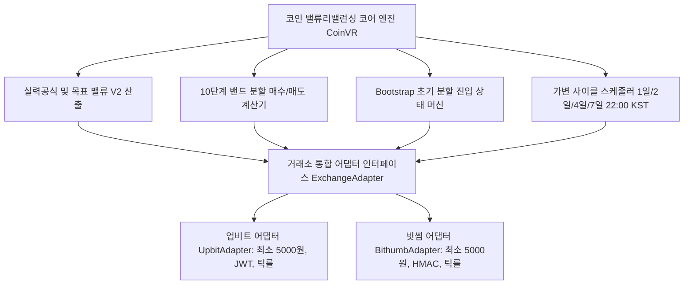

# 암호화폐(Coin) 통합 밸류 리밸런싱(Value Rebalancing, VR) 전략 명세서

본 문서는 미국/한국 주식 시장에서 검증된 **라오어의 밸류 리밸런싱(Value Rebalancing, VR) 및 실력공식(Skill Formula)**을 국내 주요 암호화폐 거래소인 **업비트(Upbit)**와 **빗썸(Bithumb)**에 통합 적용하기 위한 표준 암호화폐 밸류 리밸런싱 전략 명세서입니다.

---

## 1. 전략 개요 및 코인 시장 가변 사이클 타임 아키텍처

### 1.1. 밸류 리밸런싱(VR) 코인 통합 철학
* 주식 시장의 1주 정수 단위 매매 구조를 **암호화폐의 소수점(Float) 유동성 및 가용 자본 분할($N$등분) 구조로 전면 혁신**하여 이식합니다.
* 24시간 365일 무휴로 거래되는 코인 시장의 특성을 반영하여 **가변 사이클 주기(1일/2일/4일/7일)**, **사용자 지정 일일 갱신 시각(기본 22:00 KST)**, **하락장 방어 실력공식(Skill Formula)**, **Bootstrap(초기 시드 분할 진입) 모드**, **10단계 상/하향 밴드 분할 주문**을 통합 표준화합니다.

### 1.2. 암호화폐 가변 사이클 타임 (Cycle Time) 및 일일 갱신 시각 규격
* **사이클 주기 (Cycle Period) 선택**:
  * **1일 (24시간)**: 초고속 템포의 일일 리밸런싱
  * **2일 (48시간)**: 단기 변동성 대응 리밸런싱
  * **4일 (96시간)**: 중단기 스윙형 리밸런싱
  * **일주일 (7일, 기본 권장)**: 주간 단위 표준 리밸런싱
  * *(선택적 확장: 2주일 / 14일)*
* **전략 밸류($V$) 갱신 기준 시각 (Daily Update Time)**:
  * 하루 중 전략 $V$값을 새로 산출하고 기존 미체결 취소 및 10단계 매수/매도 밴드 주문을 재배치하는 기준 시각을 사용자가 자유롭게 설정.
  * **기본값: 22:00 KST** (09:00, 22:00, 00:00 등 사용자 지정 가능)

### 1.3. 거래소별 환경 비교 및 통합 표준 규격

| 항목 | 업비트 (Upbit) | 빗썸 (Bithumb) | 통합 표준 규격 (`CoinVR`) |
| :--- | :--- | :--- | :--- |
| **사이클 주기** | 가변 주기 지원 | 가변 주기 지원 | **1일 / 2일 / 4일 / 7일 선택 + 갱신 시각(기본 22:00)** |
| **최소 주문 금액** | 5,000 KRW | **5,000 KRW (전수 일원화)** | **5,000 KRW (`MIN_ORDER_AMOUNT_KRW = 5000`)** |
| **기본 거래 수수료** | 0.05% | 0.04% (쿠폰 적용) | 거래소 설정 파라미터화 |
| **수량 정밀도** | 소수점 4~8자리 | 소수점 4자리 | **소수점 이하 4자리 절사 (`floor * 10000 / 10000.0`)** |
| **호가 단위 (Tick)** | 업비트 틱룰 테이블 | 빗썸 틱룰 테이블 | `get_shifted_tick_price(exchange, price, shift)` |
| **대량 주문 보호** | 50만원 이하 단위 분할 발주 | 50만원 이하 단위 분할 발주 | **1건당 최대 50만원 분할 + 0.2초 딜레이** |
| **인증 방식** | JWT 토큰 (Bearer) | HMAC-SHA512 서명 | 어댑터 패턴 (`ExchangeAdapter`) 분리 |



---

## 2. 목표 밸류($V$) 산출: 실력공식 (Skill Formula)

기본 밸류 리밸런싱에 코인 급락장 방어력을 극대화한 **"실력공식"**을 적용하여 곡선형 목표 밸류($V$)를 구축합니다.

### 2.1. 실력공식 (Skill Formula) 표준 수식

사용자가 지정한 사이클 주기(예: 1일/2일/4일/7일)마다 지정된 갱신 시각(기본 22:00 KST)에 도달하면 다음 사이클의 목표 밸류($V_2$)를 아래 공식으로 갱신합니다. (사이클 진행 중에는 $V$를 임의 변경하지 않음)

$$V_2 = V_1 + \frac{\text{Pool}}{G} + \frac{E - V_1}{2\sqrt{G}} + \text{적립금}$$

* $V_1$: 이전 사이클의 목표 밸류
* $V_2$: 신규 사이클의 목표 밸류
* $E$: 직전 사이클 종료 시점(갱신 시각 22:00 KST)의 코인 총 평가액 ($E = \text{총 보유수량} \times \text{현재가}$)
* $\text{Pool}$: 현재 계좌의 가용 원화(KRW) 예수금
* $G$: 기울기 계수
  * **적립식 / 거치식**: $G = 10$ (기본 권장값)
  * **인출식 (수익금 인출 목적)**: $G = 20$
* **적립금**: 해당 사이클에 사용자가 수동/자동으로 추가 투입한 순수 원화 금액

```python
import math

def calculate_next_target_value(v1: float, pool: float, current_eval: float, 
                                G: float = 10.0, deposit: float = 0.0) -> float:
    \"\"\"코인 실력공식에 기반한 차기 목표 밸류(V2) 산출 함수\"\"\"
    term1 = v1
    term2 = pool / G
    term3 = (current_eval - v1) / (2.0 * math.sqrt(G))
    v2 = term1 + term2 + term3 + deposit
    return max(0.0, round(v2, 2))
```

> **코인 시장에서의 실력공식 작동 메커니즘**
> * **상승장 ($E > V_1$)**: 세 번째 항이 양수가 되어 목표 밸류 $V$가 점진적으로 상승, 상단 매도 밴드를 높여 이익을 극대화합니다.
> * **하락장 ($E < V_1$)**: 세 번째 항이 음수가 되어 목표 밸류 $V$의 상승을 강하게 억제하거나 하향 조정(내려앉음)합니다. 이로 인해 끝없는 물타기로 인한 예수금 조기 소진을 원천 차단합니다.

---

## 3. 고정 매매단위(`trade_unit`) 기반 분할 매수/매도 밴드 설계

암호화폐 시장의 정밀 거래 및 예측 가능한 호가 배치를 위해, 고정된 기본 매매단위($u$, `trade_unit`)와 미체결 자투리(Dust) 전량 합산 방식을 표준으로 채택합니다.

### 3.1. 밸류 밴드(Band) 정의
* **매수 밴드 하단 (Low Band)**: $V \times (1 - \text{band\_pct}/100)$ (기본 $\text{band\_pct} = 15\% \rightarrow V \times 0.85$)
* **매도 밴드 상단 (High Band)**: $V \times (1 + \text{band\_pct}/100)$ (기본 $\text{band\_pct} = 15\% \rightarrow V \times 1.15$)

### 3.2. 고정 매매단위 $u$ (`trade_unit`) 기반 분할 매수 주문 (지정가)
가용 Pool 중 사용자가 지정한 한도($25\% \sim 75\%$, 기본 50%) 내에서 Low Band 아래로 순차 하향 배치합니다.

1. **가용 Pool ($P_{\text{usable}}$)**:
   $$P_{\text{usable}} = \min(\text{실계좌 가용 KRW}, \text{설정 Pool}) \times \frac{\text{pool\_limit\_pct}}{100}$$
2. **1단계 즉시 체결 가드**:
   * 현재 평가액($E$)이 이미 Low Band 미만인 경우, 1단계 매수는 현재가($P_{\text{curr}}$)에 즉시 발주하여 가치 갭을 메웁니다.
3. **단계별 매수 가격 ($P_{\text{buy}, k}$)**:
   $$P_{\text{buy}, k} = \frac{\text{Low Band}}{\text{현재 보유 수량} + (k - 1) \cdot u}$$
   * 거래소 호가 틱룰(`get_shifted_tick_price`)로 내림 보정하며, 이전 단계 대비 최소 1틱 이상 하향되도록 유지.
4. **단계별 주문 금액 및 수량 정수화**:
   * 기본 수량 $u$ (주문금액 $< 5,000\text{ KRW}$ 시 최소 5,000 KRW를 충족하도록 올림 보정).
   * **원화 주문금액 정수화**: 거래소 규격에 따라 순수 발주 금액은 정수(`int(round(vol * price))`)로 산출.

### 3.3. 고정 매매단위 $u$ 기반 분할 매도 주문 및 자투리(Dust) 전량 합산
High Band 위로 순차적 상향 호가를 배치하며, 마지막 단계에서 잔여 수량을 전량 합산 발주합니다.

1. **분할 단계수 산출**:
   $$n_{\text{steps}} = \min\left(10, \left\lfloor \frac{Q_{\text{holding}}}{u} \right\rfloor\right) \quad (\text{최소 1})$$
2. **단계별 매도 가격 ($P_{\text{sell}, k}$)**:
   * 1단계: $P_{\text{sell}, 1} = \frac{\text{High Band}}{Q_{\text{holding}}}$
   * $k$단계: $P_{\text{sell}, k} = \frac{\text{High Band}}{Q_{\text{holding}} - (k - 1) \cdot u}$
   * 호가 올림(`math.ceil`) 보정 및 이전 단계 대비 최소 1틱 이상 상향 유지.
3. **자투리(Dust) 전량 합산 (Dust Auto-Consolidation)**:
   * $1 \sim (n_{\text{steps}} - 1)$ 단계: 기본 단위 $u$ 발주.
   * **마지막 $n_{\text{steps}}$ 단계**: 잔여 수량 전량($Q_{\text{holding}} - (n_{\text{steps}} - 1) \cdot u$)을 합산 발주하여 미체결 먼지 수량 발생을 100% 원천 차단.

---

## 4. 1회차 초기화 및 Bootstrap 모드 보존

### 4.1. 1회차 최초 목표 밸류 ($V_{\text{init}}$)
$$V_{\text{init}} = \frac{P}{G} + \frac{E}{2\sqrt{G}} + \text{적립금}$$

### 4.2. Bootstrap 선택 On/Off 보존
* 사용자가 전략 생성 시 체크박스를 통해 **초기 분할진입(Bootstrap)**을 자유롭게 켜거나 끌 수 있습니다.
* **선택 해제 시**: `bootstrap_days = 0`, `bootstrap_mode = False`로 고정되며, 이후 갱신 및 재시작 시에도 임의로 Bootstrap이 켜지지 않도록 영구 보존됩니다.

---

## 5. 실행 프로세스, 대시보드 UI 및 Fail-Safe 헬스체커

### 5.1. 가변 사이클 라이프사이클 및 타임라인 동기화
1. **사이클 경과시간**:
   * 최근 갱신 완료 시각(`last_rebalance_time`)이 존재할 경우 해당 시각 이후의 경과시간을 표출.
2. **다음 갱신 남은시간**:
   * 당일 갱신 시각(22:00 KST)이 도달하거나 초과한 경우, 자동으로 **익일 갱신 시각(다음날 22:00 KST)**으로 전진 동기화되어 `00:00:00` 멈춤 없이 안정적으로 카운트다운.

### 5.2. 대시보드 상태 뱃지 및 메트릭 표준화
* **전략 상태 / 모드**:
  * Bootstrap 모드: `🔵 Bootstrap (n/10일)`
  * 정규 운용 모드: **`🟢 RUNNING (n사이클(n일차))`** (예: `🟢 RUNNING (6사이클(7일차))`)
  * 시작일(`start_time`)을 기준으로 경과 일수($\text{day\_count} = (\text{now} - \text{start}).\text{days} + 1$)를 자동 연산.
* **가용 Pool 열**: `이전 가용 Pool: ₩{prev_pool}`을 하단에 명확히 표기.
* **전략 시작시간 영구 보존**:
  * DB 설정(`created_at`), 개별 DB `vr_state` 테이블의 `start_time` 컬럼을 통해 앱 재시작 및 파라미터 수정 시에도 최초 생성 시각이 덮어쓰여지지 않고 유지됨.

### 5.3. Fail-Safe 헬스체커 (자동 지연 보정)
* 메인 루프 또는 백그라운드 헬스체커가 갱신 예정 시각 대비 2분 이상 지연된 것을 감지하면, 즉시 자동 리밸런싱을 안전 집행하고 텔레그램 알림을 발송.
* 이미 당일 갱신이 완료된 상태인 경우 `next_update_time`을 차기 미래 시각(익일 22:00)으로 즉시 동기화.

### 5.4. 가용 Pool 롤오버 보존 및 텔레그램 메시지(시작/갱신) 개선 (2026-09-12)
1. **이전 가용 Pool (`prev_pool`) 보존 체계**:
   * 사이클 갱신(롤오버) 시 초기 설정 투자금이 아닌, **회차 적립금 충전 전 직전 사이클의 실제 가용 잔고(`current_cycle_pool` 또는 직전 가용 잔액)**를 `prev_pool`에 보존.
   * 롤오버 완료 후 당 회차의 가용 잔고를 `current_cycle_pool`로 기록하여 DB(`vr_state`)에 영구 저장.
   * 대시보드 2열 메트릭에 현재 실시간 가용 Pool(`₩{p_usable}`)과 직전 사이클의 가용 Pool(`이전 가용 Pool: ₩{prev_pool}`)이 직관적으로 대비 표시됨.
2. **텔레그램 알림 메시지 가용 Pool 표기 표준화**:
   * **전략 시작 메시지**: 기존 `운용 Pool` 대신 실제 가용 잔고를 반영한 `- <b>가용 Pool</b>: ₩{curr_usable:,.0f} (이전: ₩{prev_pool:,.0f}, 한도 {limit}%)` 표기 적용.
   * **사이클 갱신 리포트**: 기존의 고정 설정액인 `운용 Pool` 문구를 제거하고, 목표 밸류 표기와 동일하게 `- <b>가용 Pool</b>: ₩{curr_usable:,.0f} (이전: ₩{prev_pool:,.0f})`로 실시간 가용 자산을 안내. (적립금 발생 시 별도 분리 안내)

---

## 6. 빗썸(Bithumb) 이식 및 확장 가이드

1. **공통 엔진 일원화**:
   * 실력공식 $V_2$, 고정 매매단위 $u$, Dust 합산, 원화 주문금액 정수화, Fail-Safe 헬스체커 로직은 거래소에 무관하게 100% 동일하게 공유.
2. **빗썸 전용 어댑터 연동 (`BithumbApiClient`)**:
   * HMAC-SHA512 서명 기반 Private API (`POST /trade/place`, `POST /trade/cancel`).
   * 잔고 동기화: 가용 잔고(`available`) + 주문 묶임 수량(`in_use`) 합산으로 총 보유 수량(`holding_qty`) 조회.
   * 빗썸 호가 틱룰 테이블 적용.
3. **독립 DB 인프라**:
   * 빗썸 전용 설정 DB: `data/bithumb_vr_trading.db`
   * 빗썸 전략별 개별 DB: `data/strategies/bithumb_vr/{전략명}.db`

---

## 7. [2026-09-13] 손익분석 탭 VR 백테스트 시뮬레이션 및 듀얼 Y축 차트 구조 명세 (공통 코인 가이드)

미국주식 레버리지 백테스트(`D:\Python_D\kiwoom\data\backtest_result_TQQQ_VR.csv`) 구조를 표준화하여 국내 코인 거래소(업비트/빗썸) 대시보드 손익분석 탭(`tab3`)에 적용한 공통 시각화 및 데이터 분석 규격입니다.

### 7.1. Plotly 듀얼 Y축 차트 시각화 구조 (`build_vr_plotly_figure`)

```python
from plotly.subplots import make_subplots
import plotly.graph_objects as go

fig = make_subplots(specs=[[{"secondary_y": True}]])
```

#### 1) 좌측 Y축 (`secondary_y=False`, 원화 금액 ₩)
* **Total Equity (총 자산)**: 파란 실선 (`#1f77b4`, `width=2.5`)
* **Target V (목표 밸류 $V$)**: 주황 대시선 (`#ff7f0e`, `width=2`, `dash='dash'`)
* **Cash Pool (가용 원화 현금 풀)**: 하늘색 점선 (`#00e5ff`, `width=1.5`, `dash='dot'`)
* **Band Area (밸류 밴드 영역, $\pm\text{Band}\%$)**:
  * 상하한 밴드 사이 살구색 반투명 음영 (`fill='tonexty'`, `fillcolor='rgba(255, 165, 0, 0.12)'`)

#### 2) 우측 Y축 (`secondary_y=True`, 코인 시세 ₩)
* **Close Price (종가 시세)**: 회색 점선 (`#888888`, `width=1.2`, `dash='dot'`)
* **Buy Marker (매수 체결점)**: 초록색 정삼각형 ▲ (`#00c853`, `size=8`, `triangle-up`)
* **Sell Marker (매도 체결점)**: 빨간색 역삼각형 ▼ (`#d50000`, `size=8`, `triangle-down`)

---

### 7.2. 13대 표준 시뮬레이션 지표 스키마 (CSV 출력 규격)
1. `Date`: 날짜 (`YYYY-MM-DD`)
2. `Close`: 코인 일봉 종가 (KRW)
3. `TotalEquity`: 총 평가 자산 (원화 현금 + 코인 평가액)
4. `Cash`: 가용 현금 (KRW)
5. `Shares`: 보유 코인 수량 (Float)
6. `AvgPrice`: 보유 코인 평단가 (KRW)
7. `CumulativeBuyAmount`: 누적 매수 투입금 (KRW)
8. `NetPrincipal`: 총 투입 순원금 (초기 자본 + 누적 적립금)
9. `Target_V`: 해당 일자의 목표 밸류 ($V$)
10. `Pool`: 가용 Pool 잔고 (KRW)
11. `Accumulation`: 해당 일자 추가 투입된 적립금 (KRW)
12. `Peak`: 자산 전고점 (`TotalEquity.cummax()`)
13. `Drawdown`: 전고점 대비 낙폭률 ($(\text{TotalEquity} - \text{Peak}) / \text{Peak}$)

---

### 7.3. 백테스트 결과 요약 리포트 텍스트 표준
```text
=== Backtest Result ({ticker}) ===
Strategy:       VR
Ticker:         {ticker}
Period:         {days} days
Fee Rate:       {fee_rate*100:.4f}%
Initial Equity: ₩{initial_cash:,.2f}
Net Principal:  ₩{final_net_principal:,.2f}
Final Equity:   ₩{final_equity:,.2f}
Net Profit:     ₩{net_profit:,.2f}
Return:         {return_pct:.2f}%
CAGR:           {cagr_pct}
MDD:            {mdd_pct:.2f}%
Win Rate:       N/A
Result File:    data/backtest_result_{ticker}_VR.csv
```

---

### 7.4. 배포 및 실행 인프라 표준 (리버스 프록시 / 라이브러리 의존성)
1. **시각화 패키지 (`plotly`)**:
   * 업비트/빗썸 공통 손익분석 탭의 듀얼 Y축 Plotly 차트 구동을 위해 `plotly` (`>=5.0.0`) 의존성 필수 등록.
2. **리버스 프록시(Nginx/NPM) 환경 Streamlit 설정 ([`.streamlit/config.toml`](file:///d:/Python_D/gridbithumb/.streamlit/config.toml))**:
   * `enableCORS = false`, `enableXsrfProtection = false`, `headless = true` 적용으로 도메인 접속 시 정적 자산 로딩 및 CSS 프리로드 차단 원천 방지.
   * NPM 세팅: `Websockets Support` 활성화(ON), `Cache Assets` 비활성화(OFF).
3. **Python 타입 힌트 호환성**:
   * 리눅스 컨테이너 환경에서 `from typing import Any, Optional, Union` 누락으로 인한 `NameError` 방지 표준 준수.

---

### 7.5. [2026-09-15] 주문 상태 무결성(체결 vs 취소) 및 실전 메트릭 표기 표준

1. **주문 상태 무결성 원칙**:
   * **미체결 취소(`cancelled`)**: 체결 수량이 0인 취소 주문은 주문단가를 체결단가(`executed_price`)로 저장하지 않으며(`0.0` 또는 `None`), `status='cancelled'`를 엄격히 유지하여 체결 내역 및 수익률 계산에 절대 합산되지 않도록 차단.
   * **부분 체결 잔여 취소(`partial cancel`)**: 실제 체결 수량(`executed_volume > 0`)이 존재하는 경우에만 실체결 단가를 적용하고 체결 완료(`done`)로 정산 처리.
2. **실전 운용 분석 화면 메트릭 규격**:
   * 메트릭 1: `종목 / 주기` (예: `KRW-BTC (1d)`)
   * 메트릭 2: `가용 Pool` (메인: `₩{live_pool:,.0f}` | 서브: `총투입금: ₩{total_pool_deposited:,.0f}`)
   * 메트릭 3: `현재 목표 밸류 (V)` (메인: `₩{live_v:,.0f}`)
   * 메트릭 4: `누적 매매 체결 건수` (메인: `{len(executed_orders)}건` | 서브: `매수 {buy_count} / 매도 {sell_count}`)


